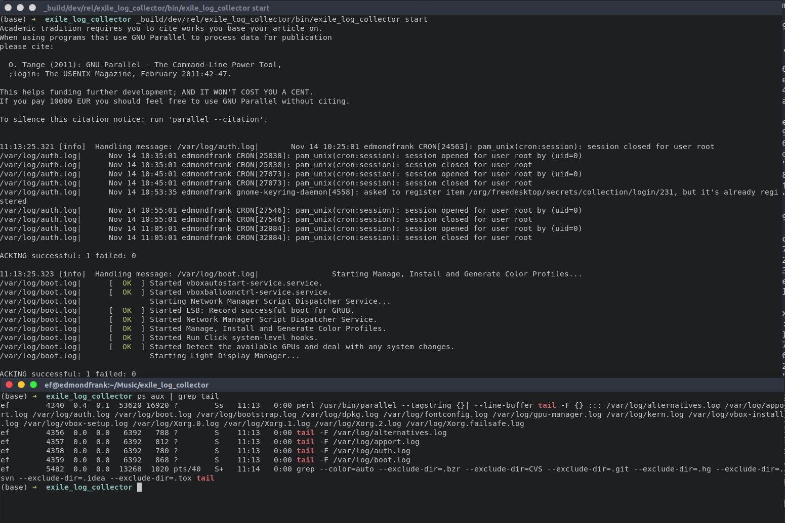
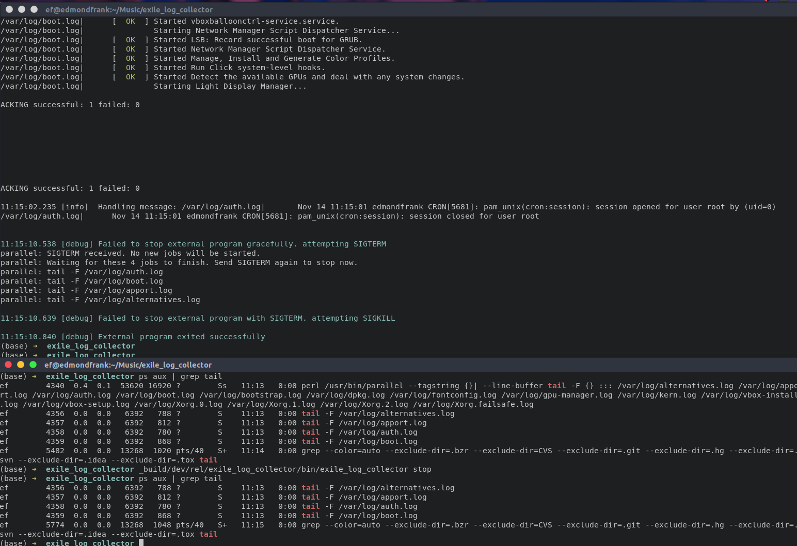

# ExileLogCollector

**Test repo for [Exile](https://github.com/akash-akya/exile/issues/47)**

## My Develop Env
```
OS:
    Ubuntu 22.04.4 LTS

Elixir:
    Elixir 1.15.7 (compiled with Erlang/OTP 26)

OTP:
    Erlang/OTP 26 [erts-14.2.5.3] [source] [64-bit] [smp:128:12] [ds:128:12:10] [async-threads:1] [jit:ns]

Arch:
    Linux amd64
```

## Reproduction

1. prepare and clone

Because GNU Parallel behavior has changed in newer versions, you need build an older version from source. to reproduce the issue.

```
wget https://ftp.gnu.org/gnu/parallel/parallel-20190122.tar.bz2
tar xvf parallel-20190122.tar.bz2
cd parallel-20190122
./configure
make
sudo make install
cd ..
git clone https://github.com/EdmondFrank/exile_log_collector
```

2. mix deps.get
```
cd exile_log_collector
mix deps.get
```

2.1. change the log files you want monitor (optional)
vim exile_log_collector/lib/exile_log_collector/application.ex
```elixir
    children = [
      # Starts a worker by calling: ExileLogCollector.Worker.start_link(arg)
      # {ExileLogCollector.Worker, arg}
      {ExileLogCollector.LogBoardway, [
          "parallel --tagstring \"{}|\" --line-buffer tail -F {} ::: /var/log/*.log" # change this line
        ]},
    ]

    # See https://hexdocs.pm/elixir/Supervisor.html
    # for other strategies and supported options
    opts = [strategy: :one_for_one, name: ExileLogCollector.Supervisor]
    Supervisor.start_link(children, opts)
```


3. build
```
mix release
```

4. run
```
_build/dev/rel/exile_log_collector/bin/exile_log_collector start

```

5. ps grep tail
```
ps aux | grep tail
```



6. stop
```
_build/dev/rel/exile_log_collector/bin/exile_log_collector stop

```

7. ps grep tail
```
ps aux | grep tail
```



After the above operation is completed, we can see in the last screenshot that although the `parallel` process is terminated, the `tail` subprocess opened by `parallel` is not graceful shutdown.

According to `parallel` [Document](https://www.gnu.org/software/parallel/parallel_tutorial.html#unconditional-termination):

```
Termination
Unconditional termination
By default GNU parallel will wait for all jobs to finish before exiting.

If you send GNU parallel the TERM signal, GNU parallel will stop spawning new jobs and wait for the remaining jobs to finish. If you send GNU parallel the TERM signal again, GNU parallel will kill all running jobs and exit.
```

I'm guessing that's probably the reason, or that it's not just `parallel`, rather than there being a class of similar programs that all have a similar situation.
